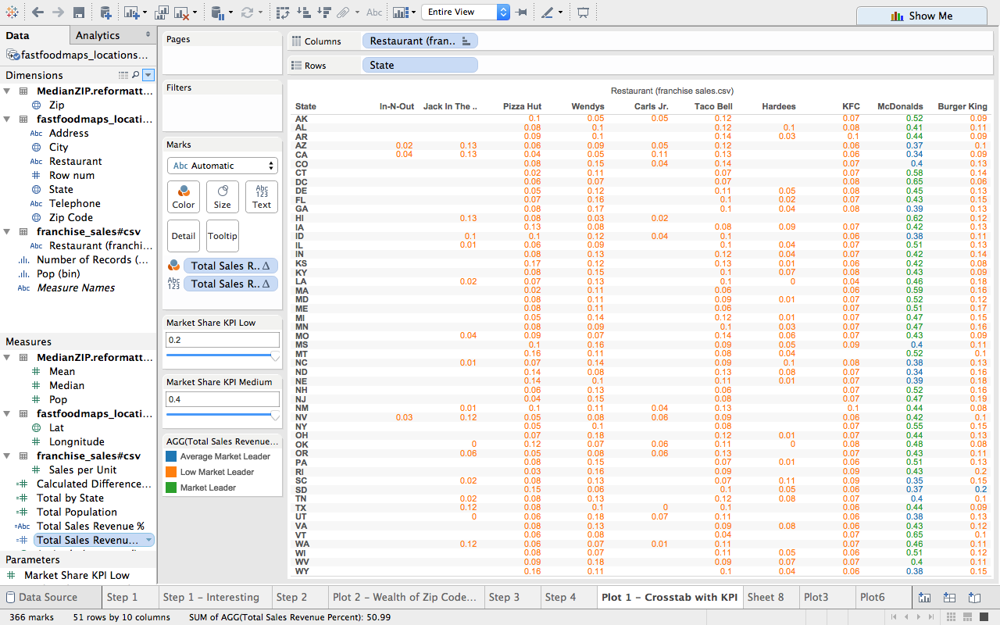

# What happens when you join Fast Food location data, ZIP Code data and Fast Food Sales Revenue data?
For this project, we joined three datasets to produce our plots. The first dataset contains location data for ten fast food establishments in the United States. The second dataset contains salary and population data for all United States ZIP codes dataset. The third dataset contains data about the average sales revenue generated by a franchise unit for the ten fast food establishments that the first dataset has. By using these three datasets, we can join on both the ZIP code field common to the first two datasets and we can join on the RESTAURANT field common to the first and third dataset. By using this newly joined data, we then produced analysis well beyond what the three datesets seperately would have been able to give us. We followed all of the steps in Dr. Cannata's presentation and were able to generate some pretty interesting plots. Specifically, we were able to look at the market share for each restaurant, the contribution of every state to the total sales revenue of each restaurant, and determine what restaruants were located in more wealthy ZIP codes.

## Session Info
This is how Rstudio is set up in order to execute the experiment and produce these results:
```{r}
sessionInfo()
```

##Shiny Application
For this project, we also built and deployed a [Shiny Application](https://smuncey.shinyapps.io/FinalProject) that showcases three of the most interesting plots we saw when analyzing these datasets.

## Fast Food location dataset
The first dataset comes from [Fast Food Maps](http://www.fastfoodmaps.com/data.html), a website that was created to show all restaruant locations of the top ten fast food chains in America. The data is from the summer of 2007. Here is a summary of that dataset:

```{r}
require("jsonlite")
require("RCurl")
# Loads the data from Fast Food table into Fast Food dataframe
# Change the USER and PASS below to be your UTEid
fast_food <- data.frame(fromJSON(getURL(URLencode('skipper.cs.utexas.edu:5001/rest/native/?query="select * from FASTFOODMAPS_LOCATIONS_2007"'),httpheader=c(DB='jdbc:oracle:thin:@sayonara.microlab.cs.utexas.edu:1521:orcl', USER='C##cs329e_cz4795', PASS='orcl_cz4795', MODE='native_mode', MODEL='model', returnDimensions = 'False', returnFor = 'JSON'), verbose = TRUE)))
summary(fast_food)
head(fast_food)
```

### A detailed explanation of each column in the Fast Food location dataset:  

* RESTAURANT - First character of fast food restaurant name (b = Burger King, M = Mcdonald's, etc.)
* ADDRESS - Fast food restaurant's address
* CITY - The city in which the specific fast food restaurant is located
* STATE - The state in which the specific fast food restaurant is located 
* ZIP - ZIP code for that specific fast food restaurant
* PHONE - Phone number for each fast food restaurant
* ROW_NUM - Record number 
* LONGNITUDE - GPS Longitude coordinates
* LAT - GPS Latitude coordinates

### Fast Food location dataset Extract, Transform, Load (ETL) script
Here is the script we used to extract, transform, and load the fast food dataset into Oracle:
```
#Before running this R file make sure you set you working directory to where the CSV file located.

file_path <- "fastfoodmaps_locations_2007.csv"

df <- read.csv(file_path, stringsAsFactors = FALSE)

# Replace "." (i.e., period) with "_" in the column names.
names(df) <- gsub("\\.+", "_", names(df))

str(df) # Uncomment this and  run just the lines to here to get column types to use for getting the list of measures.

# Generate List of Measures
measures <- c("ZIP", "Row_Num", "LAT", "LONGI")


# Make Zip codes all five digits
df$ZIP <- gsub(df$ZIP, pattern="-.*", replacement = "")
# remove leading zero on zip codes to match other data set
df$ZIP <- gsub(df$ZIP, pattern="^0", replacement = "")

#Relabel the restaurant columns
df$RESTAURANT <- gsub(df$RESTAURANT, pattern="^m", replacement = "McDonalds")
df$RESTAURANT <- gsub(df$RESTAURANT, pattern="^b", replacement = "Burger King")
df$RESTAURANT <- gsub(df$RESTAURANT, pattern="^p", replacement = "Pizza Hut")
df$RESTAURANT <- gsub(df$RESTAURANT, pattern="^t", replacement = "Taco Bell")
df$RESTAURANT <- gsub(df$RESTAURANT, pattern="^w", replacement = "Wendys")
df$RESTAURANT <- gsub(df$RESTAURANT, pattern="^j", replacement = "Jack in the Box")
df$RESTAURANT <- gsub(df$RESTAURANT, pattern="^h", replacement = "Hardees")
df$RESTAURANT <- gsub(df$RESTAURANT, pattern="^c", replacement = "Carls Jr")
df$RESTAURANT <- gsub(df$RESTAURANT, pattern="^i", replacement = "In-N-Out")
df$RESTAURANT <- gsub(df$RESTAURANT, pattern="^k", replacement = "KFC")

# Get rid of special characters in each column.
# Google ASCII Table to understand the following:
for(n in names(df)) {
  df[n] <- data.frame(lapply(df[n], gsub, pattern="[^ -~]",replacement= ""))
}

dimensions <- setdiff(names(df), measures)

#dimensions
if( length(measures) > 1 || ! is.na(dimensions)) {
  for(d in dimensions) {
    # Get rid of " and ' in dimensions.
    df[d] <- data.frame(lapply(df[d], gsub, pattern="[\"']",replacement= ""))
    # Change & to and in dimensions.
    df[d] <- data.frame(lapply(df[d], gsub, pattern="&",replacement= " and "))
    # Change : to ; in dimensions.
    df[d] <- data.frame(lapply(df[d], gsub, pattern=":",replacement= ";"))
  }
}


# Get rid of all characters in measures except for numbers, the - sign, and period.dimensions
if( length(measures) > 1 || ! is.na(measures)) {
  for(m in measures) {
    df[m] <- data.frame(lapply(df[m], gsub, pattern="[^--.0-9]",replacement= ""))
  }
}

write.csv(df, paste(gsub(".csv", "", file_path), ".reformatted.csv", sep=""), row.names=FALSE, na = "")

tableName <- gsub(" +", "_", gsub("[^A-z, 0-9, ]", "", gsub(".csv", "", file_path)))
sql <- paste("CREATE TABLE", tableName, "(\n-- Change table_name to the table name you want.\n")
if( length(measures) > 1 || ! is.na(dimensions)) {
  for(d in dimensions) {
    sql <- paste(sql, paste(d, "varchar2(4000),\n"))
  }
}
if( length(measures) > 1 || ! is.na(measures)) {
  for(m in measures) {
    if(m != tail(measures, n=1)) sql <- paste(sql, paste(m, "number(38,4),\n"))
    else sql <- paste(sql, paste(m, "number(38,4)\n"))
  }
}
sql <- paste(sql, ");")
cat(sql)

```

## ZIP code dataset
The second dataset comes from the University of Michigan's [Population Studies Center](http://www.psc.isr.umich.edu/dis/census/Features/tract2zip/). The dataset originally came from the 2010 [American Community Survey](http://www.census.gov/programs-surveys/acs/about.html) and the Center stripped out all of the columns except ZIP, POP, MEAN, and MEDIAN salaries. Here is a summary of that dataset:

```{r}
require("jsonlite")
require("RCurl")
# Loads median, mean, and population data into Zip Code dataframe
zip_code <- data.frame(fromJSON(getURL(URLencode('skipper.cs.utexas.edu:5001/rest/native/?query="select * from MedianZIP"'),httpheader=c(DB='jdbc:oracle:thin:@sayonara.microlab.cs.utexas.edu:1521:orcl', USER='C##cs329e_cz4795', PASS='orcl_cz4795', MODE='native_mode', MODEL='model', returnDimensions = 'False', returnFor = 'JSON'), verbose = TRUE)))

summary(zip_code)
head(zip_code)
```

### A detailed explanation of each column in the ZIP code dataset: 
* ZIP - US Postal ZIP code
* MEDIAN - Median salary of each ZIP code
* MEAN - Mean salary of each ZIP code
* POP - Population of each ZIP code

### ZIP Code dataset Extract, Transform, Load (ETL) script
Here is the script we used to extract, transform, and load the ZIP code dataset into Oracle:
```
#Before running this R file make sure you set you working directory to where the CSV file located.

file_path <- "MedianZIP.csv"

df <- read.csv(file_path, stringsAsFactors = FALSE)

# Replace "." (i.e., period) with "_" in the column names.
names(df) <- gsub("\\.+", "_", names(df))

str(df) # Uncomment this and  run just the lines to here to get column types to use for getting the list of measures.


measures <- c("Zip", "Median", "Mean", "Pop")

# Get rid of special characters in each column.
# Google ASCII Table to understand the following:
for(n in names(df)) {
  df[n] <- data.frame(lapply(df[n], gsub, pattern="[^ -~]",replacement= ""))
}

dimensions <- setdiff(names(df), measures)
#dimensions
if( length(measures) > 1 || ! is.na(dimensions)) {
  for(d in dimensions) {
    # Get rid of " and ' in dimensions.
    df[d] <- data.frame(lapply(df[d], gsub, pattern="[\"']",replacement= ""))
    # Change & to and in dimensions.
    df[d] <- data.frame(lapply(df[d], gsub, pattern="&",replacement= " and "))
    # Change : to ; in dimensions.
    df[d] <- data.frame(lapply(df[d], gsub, pattern=":",replacement= ";"))
  }
}


# Get rid of all characters in measures except for numbers, the - sign, and period.dimensions
if( length(measures) > 1 || ! is.na(measures)) {
  for(m in measures) {
    df[m] <- data.frame(lapply(df[m], gsub, pattern="[^--.0-9]",replacement= ""))
  }
}

df$Median <- as.numeric(levels(df$Median))[df$Median]
df$Mean <- as.numeric(levels(df$Mean))[df$Mean]
df$Pop <- as.numeric(levels(df$Pop))[df$Pop]

write.csv(df, paste(gsub(".csv", "", file_path), ".reformatted.csv", sep=""), row.names=FALSE, na = "")

tableName <- gsub(" +", "_", gsub("[^A-z, 0-9, ]", "", gsub(".csv", "", file_path)))
sql <- paste("CREATE TABLE", tableName, "(\n-- Change table_name to the table name you want.\n")
if( length(measures) > 1 || ! is.na(dimensions)) {
  for(d in dimensions) {
    sql <- paste(sql, paste(d, "varchar2(4000),\n"))
  }
}
if( length(measures) > 1 || ! is.na(measures)) {
  for(m in measures) {
    if(m != tail(measures, n=1)) sql <- paste(sql, paste(m, "number(38,4),\n"))
    else sql <- paste(sql, paste(m, "number(38,4)\n"))
  }
}
sql <- paste(sql, ");")
cat(sql)

```

## Fast Food Sales Revenue dataset
We created this dataset using data from [QSR Magazine's Top 50 quick-serve and fast-casual rankings](https://www.qsrmagazine.com/reports/top-50-sorted-rank). It is ***VERY*** important to note that by joining this to the Fast Food locations dataset, it implies that each franchise in that dataset makes the average sales revenue for that particular establishment. We realize that this is not the most accurate as there are individual franchise units that make well above and well below the average, but we do not have access to that data as that data is privately held by the respective parent company of the franchise. Nonetheless, this estimation does make for some interesting visualizations. Here is a summary of that dataset:

```{r}
require("jsonlite")
require("RCurl")
# Loads the data from Total Car Sales table into CAR_Sale dataframe
# Change the USER and PASS below to be your UTEid
fast_food_sale <- data.frame(fromJSON(getURL(URLencode('skipper.cs.utexas.edu:5001/rest/native/?query="select RESTAURANT, SALES from FASTFOOD_SALES_RANK"'),httpheader=c(DB='jdbc:oracle:thin:@sayonara.microlab.cs.utexas.edu:1521:orcl', USER='C##cs329e_cz4795', PASS='orcl_cz4795', MODE='native_mode', MODEL='model', returnDimensions = 'False', returnFor = 'JSON'), verbose = TRUE)))
summary(fast_food_sale)
```

### A detailed explanation of each column in the Fast Food Sales Revenue dataset: 
* RESTAURANT- Restaurant names
* SALES - Average sales revenue for each restaurant franchise

### Fast Food Sales Revenue dataset Extract, Transform, Load (ETL) script
Here is the script we used to extract, transform, and load the Fast Food Sales Revenue dataset into Oracle:
```
#Before running this R file make sure you set you working directory to where the CSV file located.

file_path <- "Fastfood_sales_rank.csv"

df <- read.csv(file_path, stringsAsFactors = FALSE)

# Replace "." (i.e., period) with "_" in the column names.
names(df) <- gsub("\\.+", "_", names(df))

str(df) # Uncomment this and  run just the lines to here to get column types to use for getting the list of measures.

# Generate List of Measures
measures <- c("Sales")

# Get rid of special characters in each column.
# Google ASCII Table to understand the following:
for(n in names(df)) {
  df[n] <- data.frame(lapply(df[n], gsub, pattern="[^ -~]",replacement= ""))
}

dimensions <- setdiff(names(df), measures)

#dimensions
if( length(measures) > 1 || ! is.na(dimensions)) {
  for(d in dimensions) {
    # Get rid of " and ' in dimensions.
    df[d] <- data.frame(lapply(df[d], gsub, pattern="[\"']",replacement= ""))
    # Change & to and in dimensions.
    df[d] <- data.frame(lapply(df[d], gsub, pattern="&",replacement= " and "))
    # Change : to ; in dimensions.
    df[d] <- data.frame(lapply(df[d], gsub, pattern=":",replacement= ";"))
  }
}


# Get rid of all characters in measures except for numbers, the - sign, and period.dimensions
if( length(measures) > 1 || ! is.na(measures)) {
  for(m in measures) {
    df[m] <- data.frame(lapply(df[m], gsub, pattern="[^--.0-9]",replacement= ""))
  }
}

write.csv(df, paste(gsub(".csv", "", file_path), ".reformatted.csv", sep=""), row.names=FALSE, na = "")

tableName <- gsub(" +", "_", gsub("[^A-z, 0-9, ]", "", gsub(".csv", "", file_path)))
sql <- paste("CREATE TABLE", tableName, "(\n-- Change table_name to the table name you want.\n")
if( length(measures) > 1 || ! is.na(dimensions)) {
  for(d in dimensions) {
    sql <- paste(sql, paste(d, "varchar2(4000),\n"))
  }
}
if( length(measures) > 1 || ! is.na(measures)) {
  for(m in measures) {
    if(m != tail(measures, n=1)) sql <- paste(sql, paste(m, "number(38,4),\n"))
    else sql <- paste(sql, paste(m, "number(38,4)\n"))
  }
}
sql <- paste(sql, ");")
cat(sql)
```

##Methodology for building the plots
We followed [Dr. Cannata's detailed, step-by-step methodology](http://www.cs.utexas.edu/~cannata/dataVis/Class%20Notes/_05%20Tableau%20Overview/Tableau%20Overview.pdf) for performing data analysis to produce these various plots.

### Step 1: Boxplot in Tableau
The first step in the methodolgy is to "Start with a green thing (usually a Measure) in non-aggregated mode and make a Boxplot." So, we first made a boxplot of the median salary for all ZIP codes from the ZIP code dataset. To recreate this plot, uncheck "aggregate measures" in the analysis tab and simply drag the Median green pill from the Measures column onto rows and click Boxplot on Show Me. Here is what it looked like:

image: 


### Step 1 Interesting Plot: Boxplot in R and Shiny App
We took the boxplot one step further by adding Restaurant to columns. That is when we found something interesting: all but two fast food establishments had boxplots showing pretty much the same median salary for the ZIP codes they had franchises in, except for In-N-Out and Hardee's. In-N-Out had an median salary that was alomst $10,000 above the others, while Hardee's had an meadian salary that was about $5,000 less than the others. You can find this plot in our Shiny App under the "Boxplot" tab. Here is the plot in Tableau:

image: 

Here is the plot and the code used to generate it using R:

``` {r fig.width = 15, fig.height = 10}
source("../02 R SQL/Plot3_Boxplot.R", echo = TRUE)
```

```
require("ggplot2")
require("ggthemes")
require("gplots")
require("grid")
require("RCurl")
require("reshape2")
require("tableplot")
require("tidyr")
require("dplyr")
require("jsonlite")
require("extrafont")
require("lubridate")
boxplot <- dplyr::left_join(fast_food, zip_code, by="ZIP")
ggplot() +
  coord_cartesian() + 
  scale_x_discrete() +
  scale_y_continuous() +
  labs(title="Combined MPG of every model year") +
  labs(x="Year", y="Combined MPG") +
  layer(data=boxplot , 
        mapping=aes(x=RESTAURANT, y=MEDIAN),
        stat="identity",
        stat_params=list(), 
        geom="point",
        geom_params=list(color="red"), 
        position=position_identity()
  )+ 
  layer(data = boxplot,
        mapping=aes(x=RESTAURANT, y=MEDIAN),
        stat="boxplot",
        stat_params=list(),
        geom="boxplot",
        geom_params=list(color="black",fill="red", alpha=.4),
        posiion=position_identity()
  )+
  layer(data = boxplot,
          mapping=aes(x=RESTAURANT, y=MEDIAN),
          stat="boxplot",
          stat_params=list(),
          geom="errorbar",
          geom_params=list(color="black",fill="red", alpha=.4),
          posiion=position_identity()
  )
```

### Step 2: Histogram in Tableau
The second step in the methodology is to "Start with a green thing in aggregated mode and make a Histogram." The first histogram we made depicts the total number of Fast Food establishments in the United States. To recreate this plot, click on Number of Records under Measures and then click on "Histogram" under Show Me. Then, drag Restaurant to columns. Here is what it looked like:

image: 

We spent some time making various histograms, but none of them, this one included, produced any interesting visualizations. This was because the visualizations merely reinforced what common knowledge would suggest - in the case of the first plot, McDonald's clearly had more franchises than any of the other fast food establishments, which did not surprise any of us.

### Step 3: Scatterplot in Tableau
The third step in the methodology is to "Start with 2 green things and make a Scatter plot." So, the first scatterplot we made depicts the median salary and population of all ZIP codes in the United States. To recreate this plot, drag Median under Measures to columns and drag Pop under measures to Rows. Here is what it looked like:


At first, we thought we had found an interesting scatterplot when we added a polynomial trend line on top of a plot that looked at the population and number of fast food franchises for a particular restaurant. Here is that plot in Tableau:


However, we realized rather quickly that trend lines suggest a correleation between two variables, which was a conjecture we could not reasonably support given our datasets, and thus did not include in our Shiny App.

### Step 4: Crosstab in Tableau
The fourth step in the methodology is to "Start with two blue things (usually Dimensions) plus a green thing and make a Crosstab." So, we first made a crosstab that shows the sum of the sales revenues for each restaurant by each state. To recreate this plot, take the Restaurant pill under Dimensions and add it to the Columns area. Then take the State pill under Dimensions and add it to the Rows area. Finally, take the Sales per Unit pill under Measures and add it to ABC/123 (Text). You should get this plot:


### Step 4 Interesting Plot: Crosstab in R and Shiny App
After seeing what our first crosstab looked like, we looked into creating a KPI. After some searching, we created a KPI that measures the market share a particular fast food establishment has in a given state. From this, we added two parameter controls for the user to specify what upper and lower boundries to use when determining how dominate a company was in terms of market share. The default is that a weak market leader is one who has a market share less than 20%, an average market leader has a market share between 20% and 40%, and a strong market leader has a market share greater than 40%. To recreate this plot, simply take the plot from Step 4: Crosstab in Tableau, create a calculated field called Total Sales Revenue % using this calulation: ROUND(SUM([Sales per Unit]) / TOTAL(SUM([Sales per Unit])), 2), and drag that pill twice: once to the color area and again on the text area. Here is that plot in Tableau:



Here is the plot and the code to generate the it in R:

``` {r fig.width = 15, fig.height = 20}
source("../02 R SQL/Plot1_Crosstab.R", echo = TRUE)
```

```
require(jsonlite)
require(RCurl)

# The following is equivalent to create a crosstab with a KPIs in Tableau
KPI_LOW = .2   
KPI_HIGH = .4

#Join the fast food and fast food sales dataset
crosstab <- dplyr::inner_join(fast_food, fastfood_sale, by="RESTAURANT")
# The following is equivalent to creat a crosstab with two KPIs in Tableau"
crosstab <- crosstab %>%select(RESTAURANT, SALES, STATE)%>%group_by(STATE)%>%mutate(sum_total_sales = sum(as.numeric(SALES))) %>% group_by(STATE,RESTAURANT)%>% mutate(sum_restaurant_sales = sum(as.numeric(SALES))) %>% group_by(STATE, RESTAURANT) %>% summarise(sum_total_sales = mean(sum_total_sales), sum_restaurant_sales = mean(sum_restaurant_sales)) %>% mutate(ratio_1 = sum_restaurant_sales / sum_total_sales)%>% mutate(kpi_1 = ifelse(ratio_1 < KPI_LOW, '03 Low Market Share', ifelse(ratio_1 <= KPI_HIGH, '02 Average Market Share', '01 High Market Share')))

# This line turns the State and Restaurant columns into ordered factors.
crosstab <- crosstab %>% transform(STATE = ordered(STATE), RESTAURANT = ordered(RESTAURANT))

#This generates the crosstab plot
ggplot() +
  coord_cartesian() + 
  scale_x_discrete() +
  scale_y_discrete() +
  labs(title='Market Share of Fast Food Restaurants By State') +
  labs(x=paste("Fast Food Restaurant"), y=paste("State")) +
  layer(data=crosstab, 
        mapping=aes(x=RESTAURANT, y=STATE, label=round(ratio_1, 4)), 
        stat="identity", 
        stat_params=list(), 
        geom="text",
        geom_params=list(colour="black"), 
        position=position_identity()
  ) +
  layer(data=crosstab, 
        mapping=aes(x=RESTAURANT, y=STATE, fill=kpi_1), 
        stat="identity", 
        stat_params=list(), 
        geom="tile",
        geom_params=list(alpha=0.50), 
        position=position_identity()
  ) 


```

### Step 5: Bar chart in Tableau
Step 5 of the methodology says to "Start with a blue thing and a green thing and make a Barchart." So, the first bar chart we made looked at the sales revenue generated by all franchise locations in the United States for the 10 restaurants. This visualization did not produce anything interesting expect for the fact that McDonald's not only makes more than all the other fast food chains, but by an enormous margin. To recreate this plot, take the Restaurant pill under Dimensions and place it in the columns area and take the Sales per Unit pill under Measures and place it in the rows area. Here is that plot in Tableau:


### Step 5 Interesting Plot: Bar chart in R and Shiny App

We took the original bar chart one step further by seeing if there were states that contributed more to a fast food establishment's overall U.S. sales revenue than other states. For example, the Market Share KPI crosstab showed that McDonald's had a dominate market share in almost every state, but we were curious to see which state, if any, was contributing the most to McDonald's total U.S. sales revenue. To do this, we added a KPI that looked at the difference between the sales of state and average sales of United States for each restaurant. To recreate this plot, flip the axis and add the State pill to the rows area. Then, create a calculated field called Calculated Difference from the Average (table calculation) with the following calculation: SUM([Sales per Unit]) - WINDOW_AVG(SUM([Sales per Unit])). Drag that pill twice: once to color and once to text. Finally, navigate to the Analytics tab and drag the average line onto panes. Here is that plot in Tableau:


When recreating this plot in R and the Shiny App, we added the average line to show the average sales of all 50 United States for each restaurant. Additionally, the red numbers represent the difference in dollars between the sales of each state and the average sales revenue of all 50 states. Here is the plot and the code to generate it in R:

``` {r fig.width = 15, fig.height = 25}
source("../02 R SQL/Plot2_Barchart.R", echo = TRUE)
```

```
require("jsonlite")
require("RCurl")
require(dplyr)
require(tidyr)
require(ggplot2)
require(reshape2)
library(scales)
#Join fast food locations and fast food sales by franchise unit datasets
join_data<-dplyr::inner_join(fast_food, fast_food_sale, by="RESTAURANT") 

#R workflow to generate the bar chart
bar_chart <- join_data %>% select(STATE, RESTAURANT, SALES) %>% subset(STATE%in% c("AK", "AL","AR","AZ","CA","CO", "CT", "DC", "DE", "FL", "GA", "HI", "IA", "ID", "IL", "IN", "KS", "KY", "LA", "MA", "MD", "ME", "MI", "MN", "MO", "MS", "MT", "NC", "ND", "NE", "NH", "NJ", "NM", "NV", "NY", "OH", "OK", "OR", "PA", "RI", "SC", "SD", "TN", "TX", "UT", "VA", "VT", "WA", "WI", "WV", "WY"))%>%subset(RESTAURANT%in% c("McDonalds", "Burger King"))%>%group_by(STATE,RESTAURANT) %>% summarise(sum_sales = sum(as.numeric(SALES)))%>%melt(id.vars = c("STATE","RESTAURANT"))%>%group_by(variable)%>%group_by(STATE)%>%group_by(STATE)

#Generate window average 
WINDOW_AVG=aggregate(bar_chart[, 4], list(RESTAURANT=bar_chart$RESTAURANT), mean)

bar_chart<-dplyr::right_join(bar_chart, WINDOW_AVG, by="RESTAURANT")

bar_chart<-bar_chart %>% select (STATE,RESTAURANT,variable,value.x,value.y)%>%mutate(Diff_To_Avg = value.x - value.y)
#Plot Function to generate bar chart with reference line and values
ggplot() + 
  coord_cartesian() + 
  scale_x_discrete() +
  scale_y_continuous() +
  facet_wrap(~RESTAURANT) +
  labs(title='Total sales of every fastfood restaurant in every state ') +
  labs(x=paste("State"), y=paste("Sales")) +
  layer(data=bar_chart, 
        mapping=aes(x=STATE, y=value.x), 
        stat="identity", 
        stat_params=list(), 
        geom="bar",
        geom_params=list(fill="steelblue"), 
        position=position_dodge()
  )+ coord_flip()+  
  layer(data=bar_chart, 
        mapping=aes(x=STATE, y=value.x, label=round(value.x,2)),
        stat="identity", 
        stat_params=list(), 
        geom="text",
        geom_params=list(colour="black", hjust=0), 
        position=position_identity()
  )+
  layer(data=bar_chart, 
         mapping=aes(yintercept = value.y), 
         geom="hline",
         linetype="dashed",
         size=2,
         geom_params=list(colour="red")
  )+
  layer(data=bar_chart, 
        mapping=aes(x=STATE, y=value.x, label=round(Diff_To_Avg)), 
        stat="identity", 
        stat_params=list(), 
        geom="text",
        geom_params=list(colour="red", hjust=-2), 
        position=position_identity()
  )

```

### Bonus Plot - Map
This map plot was created because we had location data on more than 50,000 fast food restaurant locations. Maps in R are not as flexible as they are in Tableau; thus, we were only able to generate this map that plots the location of each restaurant. It is interesting from the perspective that you can visually see where the majority of restaurants are located or where a particular brand holds a lot of fast food locations. Here is the plot in Tableau:


The map will not generate in a r markdown html document. To view the plot, simply look at the Bonus_Map.R file under the 02 R SQL folder. Here is the code that generated that plot:

```
require(leaflet)

locations <- fast_food %>% subset(RESTAURANT %in% c("Burger King", "McDonalds"))
content <- paste(sep = "<br/>",
                 locations$RESTAURANT,
                 locations$ADDRESS,
                 paste(sep = " ", locations$CITY, locations$STATE, locations$ZIP
))
leaflet(data = locations) %>% addTiles() %>% 
  addMarkers( ~LONGI, ~LAT, popup = ~content ,
  clusterOptions = markerClusterOptions()
)


```
